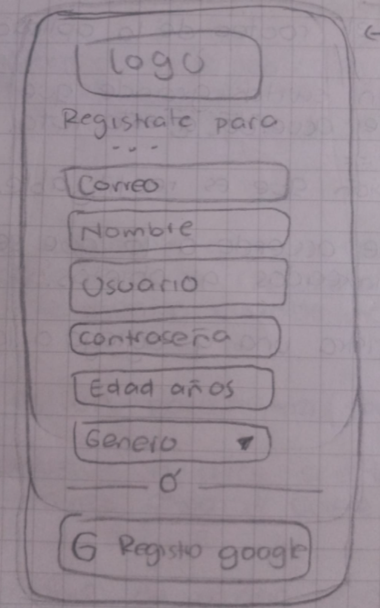
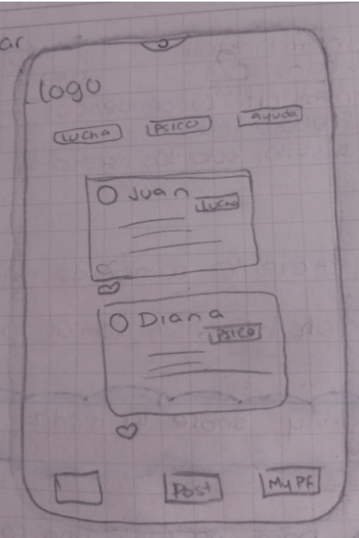
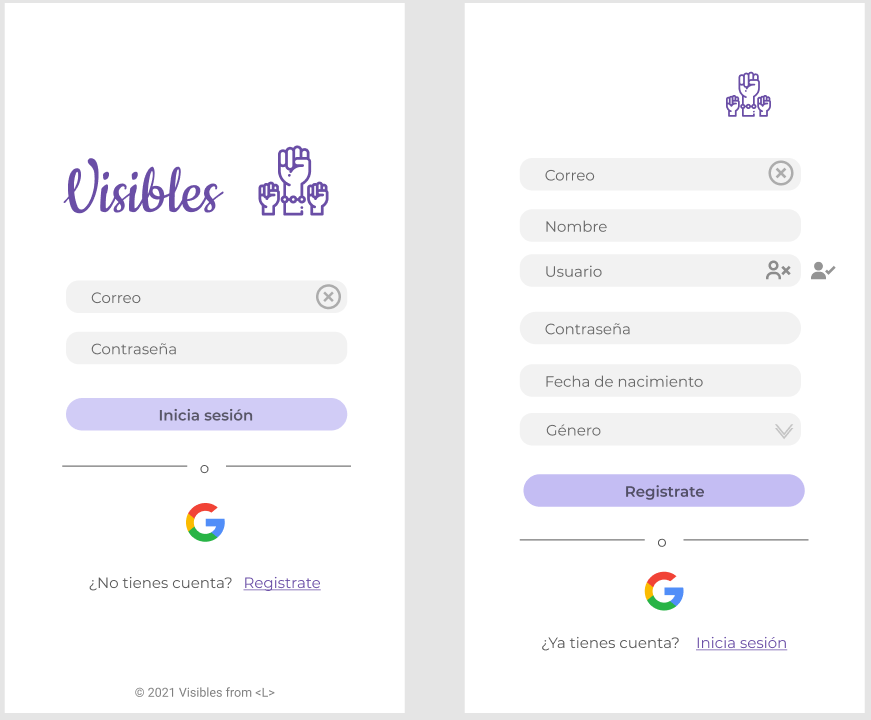

# Visibles - Red social

## Índice

* [1. Definición del producto](#1-definición-del-producto)
* [2. Prototipos](#2-prototipos)
* [3. Historias de usuario](#3-historias-de-usuario)
* [4. Feedback](#4-feedback)
* [5. Tecnologías usadas](#6-tecnologías-usadas)

## 1. Definición del producto

Teniendo en cuenta la desigualdad presentada en la sociedad por los diferentes estereotipos se pensó en desarrollar una red social enfocada en visibilizar e informar sobre las diferentes problemáticas de desigualdad de género. 

Visibles está enfocada en personas mayores de 12 años interesadas en informarse, aportar y aprender sobre igualdad de género, promoviendo la inclusión y el respeto por la diversidad. 

A demas, ayuda a generar conciencia entre los usuarios a través de información segura y confiable sobre igualdad de género con el fin de que nuestros usuarios se informen para contribuir en la construcción de una sociedad más equitativa, solucionando el problema de la indiferencia y la desinformación. A través de la tecnología se busca fomentar el desarrollo de una sociedad más equitativa donde se tenga en cuenta que todos somos iguales en derechos.

## 2. Prototipos

### Paleta de colores

La paleta de colores escogida se basa en tonos morados como representación del feminismo que promueve la equidad. 

### Prototipos de baja fidelidad

Se realizaron prototipos basados en la encuesta realizada a diferentes personas, que sirvió de guia para nuestro diseño.

### Prototipos de alta fidelidad

[Ver prototipos de alta fidelidad](https://www.figma.com/proto/s2gMgpxNZD1jnSBVBDvulA/Social-Network?node-id=46%3A112&scaling=scale-down&page-id=0%3A1&starting-point-node-id=1%3A2&show-proto-sidebar=1)

### Restultado final

## 3. Historias de usuario 

### HU1

Yo como usuario interesado en aprender y difundir información sobre equidad de género, quiero **registrarme** en la red social con mi usuario y contraseña o  acceder con Google para poder ingresar a la red social y hacer parte de una comunidad que promueva la igualdad de género.

**Criterios de aceptación**

 - [X] Que el usuario pueda ver el formulario de login a la red social con usuario y contraseña o con Google

 - [X] Que haya opción de registrarse con el formulario que pide información del usuario (nombre, usuario, correo, contraseña)

 - [X] Que se valide si el correo ingresado para registrarse es válido o no y si no es válido, informe al usuario que el correo no es válido o ya está en uso (mensaje de error)

 - [X] Si el nombre de usuario ya existe no debe permitir poner el mismo, mostrando al usuario un símbolo de error  :x: y si no está repetido que muestre aprobación :ballot_box_with_check:

 - [X] Al oprimir el botón registrar y si todo está correcto, pedir número de confirmación o que confirme su correo ingresando al enlace enviado por correo electrónico.

 - [X] Que el usuario pueda tener la opción de registrarse con Google con un botón (nombre de usuario aleatorio?).

 - [X] Que el usuario pueda tener la opción de registrarse con Google con un botón (nombre de usuario aleatorio?).	

 - [X] Cuando el usuario confirme su registro con un link que lo lleve a la página de confirmación para logearse

### HU2

Yo como usuario de visibles quiero publicar **post** relacionados con el tema de la aplicación para divulgar mi punto de vista relacionado con algún tema referente a la equidad de género, también quiero poder etiquetar el tipo de contenido que publico para filtrar los temas por etiqueta

**Criterios de aceptación**

 - [X] Que el usuario pueda ver el menú con los tres iconos, que el botón de **Sign out** lo dirija al login, **casa** muestra todas las publicaciones, **+**: en el icono + se puede añadir un nuevo post.

 - [X] Para añadir un post se mostrara una ventana modal con un input y con una opción de elegir etiquetas

 - [X] Poner un div que contenga el texto que se escribe en el input

 - [X] No puede hacer un post con contenido vacío 

 - [X] Que cada post tenga el nombre de usuario

 - [X] Se debe verificar si el usuario está logueado antes de mostrar contenido, si el usuario escribe otro hash permanezca en home si esta logueado a menos que oprima sign out  o en login si no se ha logueado

 - [X] Poder **editar** los post propios, (se debe mostrar el post actual en la ventana de publicar post) y guardar los cambios

### HU3

Yo como usuario de visibles quiero poder ver el feed de publicaciones para interactuar con las publicaciones de los demás usuarios (Like) 

**Criterios de aceptación**

 - [X] Funcionalidad de eliminar post - con ventana de confirmar

 - [X] Que el usuario pueda dar o quitar like a una publicación

 - [X] Que cada publicación muestre el # de likes

## 4. Feedback

Al hacer los test de usabilidad se recibieron algunas sugerencias para tener en cuenta en el diseño de la aplicación: 

 - [X] Avisarle al usuario que el correo de verificació no fue enviado y que lo confirme para poder logearse

 - [X] Hacer el botón de Google más descriptivo

 - [X] Que el logo que se encuentra en login podría llevar el titulo de la app

## 5. Tecnologías usadas

### CSS

- [X] **Uso de flexbox en CSS**

- [X] **Uso de CSS Grid Layout**

### Web APIs

- [X] **Uso de selectores del DOM**

- [X] **Manipulación dinámica del DOM**

- [X] **Ruteado (History API, evento hashchange, window.location)**

### JavaScript

- [X] **Objetos (key, value)**

- [X] **Diferenciar entre tipos de datos primitivos y no primitivos**

- [X] **Variables (declaración, asignación, ámbito)**

- [X] **Uso de condicionales (if-else, switch, operador ternario, lógica booleana)**

- [X] **Funciones (params, args, return)**

- [X] **Pruebas unitarias (unit tests)**

- [X] **Uso de mocks y espías**

- [X] **Módulos de ECMAScript (ES Modules)**

- [X] **Uso de linter (ESLINT)**

- [X] **Promesas**

### Control de Versiones (Git y GitHub)

- [X] **Git: Control de versiones con git (init, clone, add, commit, status, push, pull, remote)**

- [X] **Git: Integración de cambios entre ramas (branch, checkout, fetch, merge, reset, rebase, tag)**

- [X] **GitHub: Creación de cuenta y repos, configuración de llaves SSH**

- [X] **GitHub: Despliegue con GitHub Pages**

- [X] **GitHub: Colaboración en Github (branches | forks | pull requests | code review | tags)**

### UX (User eXperience)

- [X] **Diseñar la aplicación pensando en y entendiendo al usuario**

- [X] **Crear prototipos para obtener feedback e iterar**

- [X] **Aplicar los principios de diseño visual (contraste, alineación, jerarquía)**

- [X] **Planear y ejecutar tests de usabilidad**

### Firebase

- [X] **Firebase Auth**

- [X] **Firestore**
